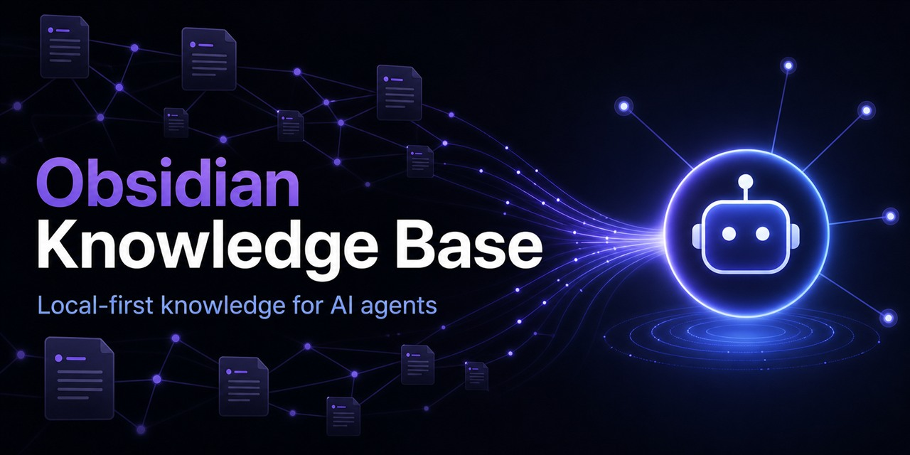

# Obsidian Knowledge Base

<p align="center">
  <a href="./README.md">简体中文</a> · <strong>English</strong>
</p>

<p align="center">
  
</p>

[](https://github.com/qunqingcode/obsidian-knowledge-base/actions/workflows/test.yml)
[](./LICENSE)
[](https://skills.sh/qunqingcode/obsidian-knowledge-base/obsidian-knowledge-base)

Turn a local Obsidian vault into the default private knowledge base for AI agents such as Codex, Claude Code, and Cursor.

Agents follow the same tool-independent private-knowledge policy to decide when retrieval is needed, search local Markdown, read source notes, expand results through links, and cite their evidence. Markdown remains the single source of truth, and your vault does not need to be uploaded to the cloud.

**Local-first · Read-only by default · No cloud embeddings required · Traceable answers**

[Quick install](#quick-install) · [Let an agent install it](#let-an-agent-install-it) · [How it works](#how-it-works) · [Security boundaries](#security-boundaries) · [Documentation](#documentation)

## How it works

After installation, you do not need to tell the agent to "search Obsidian" every time. Ask a natural-language question such as:

```text
Why did we change that setting last time?
```

The agent will:

```text
Decide whether the question may depend on private knowledge
  → Search relevant Markdown files in the local vault
  → Read source notes and follow direct links to related notes
  → Check for sensitive, conflicting, or stale evidence
  → Answer with source paths and modification dates
```

It can also answer graph-oriented questions:

- "Which notes link back to this note?"
- "What is the shortest path between notes A and B?"
- "Find the central notes and isolated notes in this vault."
- "Generate a knowledge-graph health report for the vault."

## Quick install

Download or clone this repository, then run one command in PowerShell:

```powershell
.\install.ps1 -VaultPath "D:\Your Obsidian Vault"
```

The installer detects existing Codex, Claude Code, Cursor, or generic `.agents/skills` directories, deploys the skill, creates its configuration, installs the optional QMD search backend, and runs the `doctor` checks.

To select an agent or target directory explicitly:

```powershell
.\install.ps1 -VaultPath "D:\Vault" -Agent claude
.\install.ps1 -VaultPath "D:\Vault" -Agent custom -TargetPath "D:\agent\skills\obsidian-knowledge-base"
```

Add `-SkipQmd` if you do not want to install QMD. Full-text search will fall back to the built-in file backend, and graph queries do not require Obsidian to be running.

Run diagnostics after installation:

```powershell
.\scripts\doctor.ps1
```

## Let an agent install it

Send the following prompt to an agent that supports Agent Skills and local command execution:

```text
Read and strictly follow the installation runbook below. Connect my Obsidian vault as the agent's default private knowledge base.
Continue through environment checks, dependency installation, skill deployment, configuration, and verification. Do not stop at instructions unless the vault path cannot be determined.

https://github.com/qunqingcode/obsidian-knowledge-base/blob/main/docs/AGENT-INSTALL.md
```

The runbook is currently written in Chinese, but its commands, variables, acceptance criteria, and safety boundaries are explicit and agent-readable.

The agent will:

1. Locate or ask for the Obsidian vault.
2. Check Node.js, QMD, and the Obsidian CLI.
3. Install the skill into the current user's Agent Skills directory.
4. Create a private local `config.json`.
5. Build a local BM25 index while retaining the built-in fallback.
6. Verify search, citation, and knowledge-graph features.

The default behavior is `auto`, so subsequent tasks can directly ask questions such as:

```text
Where is the document I wrote recently?
Why did we change that setting last time?
Which notes mention the same topic?
Find isolated notes with no links.
```

## Install through skills.sh

To install only the skill files:

```powershell
npx skills add https://github.com/qunqingcode/obsidian-knowledge-base `
  --skill obsidian-knowledge-base `
  --agent codex `
  --global `
  --copy `
  --yes
```

Replace `codex` with your agent's CLI identifier. This installs the skill into a user-level directory, but it does not select a vault, install QMD, or create the private configuration. For a first-time setup, the one-command installer or agent runbook is recommended.

## Behavior modes

Set the mode in the local `config.json`:

```json
{
  "behavior": {
    "mode": "auto",
    "log_retention_days": 30
  }
}
```

| Mode | Behavior | Recommended use |
|---|---|---|
| `auto` | Automatically decides when private knowledge is needed; does not log routing events | Default |
| `on_demand` | Runs only when the user explicitly requests a vault search | Fully manual control |
| `audit` | Uses automatic routing and writes redacted evaluation logs locally | Routing diagnostics and retrieval evaluation |

Logs stay in the skill's local `logs/` directory, contain no note bodies, and redact passwords, tokens, account identifiers, and IP addresses.

## Core features

- Tool-independent routing, privacy, evidence, and citation rules shared by different agents
- Local QMD/BM25 full-text search with no required cloud embedding API
- Automatic fallback to built-in file search when QMD is unavailable
- Source-note reading with local file citations and modification dates
- One-hop link expansion after a search hit, with graph results treated only as candidates
- Outlinks, backlinks, N-hop neighbors, shortest paths, and relationship summaries
- Connected components, hubs, bridges, isolated notes, unresolved links, and graph-health analysis
- Live Obsidian link-cache support with automatic fallback to Markdown parsing
- Sensitive results hidden unless the user explicitly requests the relevant information
- Protection against instructions embedded in notes that attempt to change agent behavior or permissions
- Distinct handling for empty results, timeouts, read failures, and insufficient evidence

## Why this is not another Obsidian MCP server

MCP servers and the Obsidian CLI mainly define which tools an agent can call. This project additionally defines:

- when private knowledge should be queried;
- which candidates may be read;
- what evidence may enter the final answer;
- how conflicting, stale, or sensitive notes are handled;
- how routing and retrieval quality can be evaluated locally.

It can run independently or act as a retrieval and evidence-policy layer above existing agent tools.

## Security boundaries

- The skill is read-only by default and does not automatically edit, move, or delete vault notes.
- `config.json`, local indexes, and logs are excluded through `.gitignore`.
- Do not store production credentials directly in Markdown; store references to a password manager instead.
- Obsidian CLI `eval` is powerful, so the project only invokes fixed graph-query code included in the repository.
- Private sensitive notes should not be retrieved in multi-user, remote, or group-chat environments.

## Tests

The repository includes a synthetic test vault with no real private data. Tests cover:

- one-command installation, automatic configuration, and `doctor` verification;
- built-in full-text search when QMD is unavailable;
- one-hop link expansion after `context` search hits;
- Markdown link parsing and unresolved links;
- shortest paths, bridges, and isolated-note statistics;
- `on_demand`, `auto`, and `audit` modes;
- IP address and credential redaction in routing logs;
- basic validation of the skill frontmatter.

Run the tests on Windows:

```powershell
.\tests\run-tests.ps1
```

Every push and pull request runs the test suite through GitHub Actions with Node.js 22 and PowerShell.

## Documentation

- [Agent installation runbook (Chinese)](./docs/AGENT-INSTALL.md)
- [Complete installation guide (Chinese)](./docs/obsidian-knowledge-base-安装文档.md)
- [Graph query reference (Chinese)](./docs/graph-queries.md)
- [Retrieval evaluation specification](./references/evaluation.md)
- [Contributing guide](./CONTRIBUTING.md)
- [Security policy](./SECURITY.md)
- [Changelog](./CHANGELOG.md)
- [Third-party notices](./docs/THIRD_PARTY_NOTICES.md)

## Platform support

The current release is Windows-first:

- Windows 10/11
- PowerShell 5.1+
- Node.js 18+ (current LTS recommended)
- A local agent that supports Agent Skills
- Obsidian 1.12.7+ for live graph access; the file backend works without it

## License

[MIT](./LICENSE). The graph-query features adapt ideas from the MIT-licensed `azuma520/obsidian-graph-query` project. See [Third-party notices](./docs/THIRD_PARTY_NOTICES.md).
