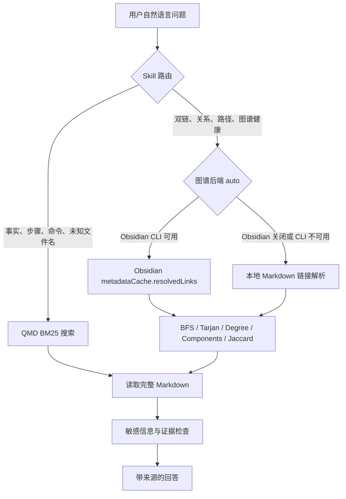

# Obsidian Knowledge Base

> 面向 Codex 及兼容 Agent Skills 的本地优先 Obsidian 知识库与知识图谱 Skill

## 1. 项目定位

### 一句话定位

将一个本地 Obsidian Vault 变成 AI Agent 默认使用的私人知识层：用户直接用自然语言提问，Agent 自动完成全文检索、笔记读取、双链图遍历、来源引用和敏感信息控制。

### 它解决什么问题

传统 Obsidian 使用流程通常是：

1. 用户记得“以前写过”；
2. 打开 Obsidian；
3. 猜关键词和文件名；
4. 在多篇笔记间手动点击双链；
5. 复制内容给 AI；
6. 再判断 AI 是否误解了原文。

本项目把流程缩短为一句自然语言，例如：

- “某项服务怎么部署？”
- “以前写过的部署文档在哪？”
- “这篇笔记有哪些反向链接？”
- “示例文档和变更文档之间是什么关系？”
- “找出知识库里的核心节点和孤岛笔记。”

Agent 会根据问题类型自动选择全文检索或图查询，并在回答中引用原始 Markdown 文件。

### 产品形态

本项目是一个 Agent Skill，而不是：

- Obsidian 的替代品；
- 独立知识库 SaaS；
- 密码管理器；
- 自动修改笔记的机器人；
- 完整的企业权限管理平台；
- 默认依赖向量数据库的重型 RAG 系统。

它更接近：

> Obsidian + Agent Skills + 本地检索 + 可查询双链图的轻量 AgentWiki。

## 2. 核心价值

### 2.1 零迁移

知识仍然保存在普通 Markdown 和 Obsidian Vault 中，不需要导入专有数据库，也不改变原来的笔记习惯。

### 2.2 默认使用私人知识

Skill 的触发描述覆盖了文档、部署、安装、历史记录、内部信息、双链和图谱问题。用户不必每次重复“去我的 Obsidian 查一下”。

### 2.3 内容检索与关系检索分离

- QMD/BM25 负责“哪篇笔记包含这条信息”；
- Obsidian 双链图负责“这些笔记是怎么连接的”；
- Agent 负责读取原文、解释关系和组织答案。

这种分工比“把所有内容一次性塞进上下文”更稳定，也更节省 Token。

### 2.4 本地优先

当前默认搜索路径不要求云端 Embedding API：

- QMD 使用本地 BM25；
- 图查询读取 Obsidian 实时链接缓存；
- Obsidian 不可用时，可直接解析本地 Markdown 作为降级后端。

### 2.5 可追溯

回答引用原始笔记路径，并区分：

- Frontmatter 明确关系；
- Inline Dataview 明确关系；
- 正向/反向链接等结构关系；
- AI 根据两端正文做出的语义推断。

### 2.6 安全边界

项目默认只读，并包含：

- Vault 路径边界检查；
- 搜索结果敏感信息识别与预览隐藏；
- 只有用户明确请求时才读取账密候选；
- 链接建议只作为候选，不自动修改笔记；
- 忽略笔记内试图改变 Agent 权限或规则的内容。

## 3. 技术架构



### 主要组件

| 文件 | 作用 |
|---|---|
| `SKILL.md` | 触发条件、路由规则、证据与安全策略 |
| `config.json` | Vault、QMD 和图谱后端配置 |
| `scripts/vault.ps1` | 所有能力的统一命令入口 |
| `scripts/graph.ps1` | Obsidian/文件图谱后端选择与调用 |
| `scripts/graph-engine.js` | 链接解析和图算法实现 |
| `docs/graph-queries.md` | 图查询参数与结果解释 |
| `docs/THIRD_PARTY_NOTICES.md` | 第三方 MIT 许可声明 |

### 图谱能力

| 模式 | 能力 |
|---|---|
| `links` | 查询一篇笔记的出链 |
| `backlinks` | 查询一篇笔记的反向链接 |
| `neighbors` | 查询 1–5 跳邻居 |
| `path` | BFS 最短路径和每条边的方向、来源 |
| `cluster` | 查询笔记所在连通分量 |
| `bridges` | Iterative Tarjan 桥边和割点 |
| `hubs` | 按入度、出度和总度查找核心笔记 |
| `orphans` | 查找没有入链和出链的孤岛笔记 |
| `relations` | 汇总 Frontmatter、Dataview、出链和反链 |
| `unresolved` | 查找无法解析的链接 |
| `suggest-links` | 基于属性和共同邻居生成缺失链接候选 |
| `stats` | 全库节点、边、分量和文件夹统计 |
| `health` | 生成知识图谱健康指标 |
| `report` | 汇总统计、Hub、桥、孤岛和健康数据 |

## 4. 适合谁

### 推荐使用

- 使用 Obsidian 管理部署文档、项目记录和内部操作手册；
- 希望 Codex/Claude Code 等 Agent 默认参考个人知识库；
- 需要查询双链、反向链接和多跳关系；
- 不希望把完整 Vault 上传到第三方 RAG 平台；
- 想保留 Markdown 作为唯一事实来源；
- 中小规模个人或团队知识库。

### 不建议直接使用

- 需要严格的多用户、行列级权限和审计；
- Vault 内长期明文保存大量生产密码；
- 希望完全脱离本地文件系统运行；
- 需要跨数百万节点的企业知识图谱；
- 需要本体、实体消歧和形式逻辑推理；
- 希望 AI 无确认地自动重构全部笔记。

## 5. 安装

### 5.1 环境要求

- Windows 10/11；
- PowerShell 5.1 或更高版本；
- Node.js 18 或更高版本，推荐当前 LTS；
- Obsidian 1.12.7 或更高版本，用于实时图谱后端；
- 支持 Agent Skills 的 Agent，例如 Codex；
- 一个本地 Obsidian Vault。

项目的一键安装器会检查 Node.js 并安装可选 QMD 后端。QMD 不可用时会自动使用内置文件搜索。手动安装 QMD 的方式是：

```powershell
npm install -g @tobilu/qmd
```

参考：[QMD 官方仓库](https://github.com/tobi/qmd)。

### 5.2 安装 Skill

推荐在仓库根目录直接运行：

```powershell
.\install.ps1 -VaultPath "D:\你的 Obsidian Vault"
```

它会识别 Agent Skills 目录、生成配置并运行 `doctor`。未知 Agent 可使用
`-Agent custom -TargetPath <目录>`。

#### 尚未发布到 Skills 生态时

将整个目录复制到：

```text
C:\Users\<用户名>\.codex\skills\obsidian-knowledge-base
```

最终结构：

```text
obsidian-knowledge-base/
├── SKILL.md
├── config.json
├── agents/
│   └── openai.yaml
├── scripts/
│   ├── vault.ps1
│   ├── graph.ps1
│   └── graph-engine.js
└── docs/
    ├── graph-queries.md
    └── THIRD_PARTY_NOTICES.md
```

#### 发布到 GitHub/skills.sh 后

```powershell
npx skills add OWNER/REPO@obsidian-knowledge-base -g -y
```

Skills CLI 支持用 `npx skills add <owner>/<repo>` 安装 Agent Skill。参考：[Skills CLI 文档](https://www.skills.sh/docs/cli)。

### 5.3 创建 QMD Collection

```powershell
qmd collection add "C:\path\to\your\vault" --name obsidian --mask "**/*.md"
qmd update
qmd collection list
```

如果 `obsidian` 名称已被占用，可更换名称，并同步修改 `config.json` 的 `qmd_collection`。

本 Skill 的全文搜索只调用 `qmd search`，即 BM25 搜索；不会自动下载或运行 Embedding/重排模型。

### 5.4 启用 Obsidian CLI

实时图谱后端需要 Obsidian CLI：

1. 安装 Obsidian 1.12.7 或更高版本；
2. 打开 `设置 → 关于/General → 高级`；
3. 启用“命令行界面”；
4. 按提示完成 PATH 注册；
5. 重新打开终端。

验证：

```powershell
obsidian version
obsidian vaults verbose format=json
```

Obsidian CLI 官方支持 `links`、`backlinks`、`unresolved`、`orphans` 和 `eval` 等能力。参考：[Obsidian CLI 官方文档](https://obsidian.md/help/cli)。

### 5.5 配置

复制一份配置模板为 `config.json`，填入本机绝对路径：

```json
{
  "vault_path": "C:\\path\\to\\your\\vault",
  "qmd_executable": "C:\\path\\to\\node.exe",
  "qmd_entry": "C:\\path\\to\\node_modules\\@tobilu\\qmd\\dist\\cli\\qmd.js",
  "qmd_collection": "obsidian",
  "behavior": {
    "mode": "auto",
    "log_retention_days": 30
  },
  "graph": {
    "backend": "auto",
    "obsidian_cli": "C:\\Program Files\\Obsidian\\Obsidian.com",
    "obsidian_vault": "your-vault-name",
    "excluded_folders": [
      ".obsidian/",
      ".trash/",
      ".git/",
      "attachments/",
      "templates/"
    ],
    "relationship_fields": [
      "Up",
      "Source",
      "References",
      "来源",
      "参考",
      "应用于",
      "衍生自"
    ],
    "frontmatter_mapping": {
      "domain": "专业",
      "source": "来源",
      "noteType": "笔记类型"
    }
  }
}
```

PowerShell 中可以这样查找运行时路径：

```powershell
(Get-Command node).Source
npm root -g
```

`qmd_entry` 通常位于：

```text
<npm root -g>\@tobilu\qmd\dist\cli\qmd.js
```

### 5.6 验证安装

进入 Skill 目录：

```powershell
cd "$env:USERPROFILE\.codex\skills\obsidian-knowledge-base"
```

测试全文检索和一跳关联扩展：

```powershell
.\scripts\vault.ps1 -Mode context -Query "部署" -MaxResults 5 -MaxRelated 10
```

测试图谱：

```powershell
.\scripts\vault.ps1 -Mode stats
.\scripts\vault.ps1 -Mode hubs -Top 10
.\scripts\vault.ps1 -Mode health
```

测试一篇具体笔记：

```powershell
.\scripts\vault.ps1 -Mode backlinks -Note "某篇笔记.md"
.\scripts\vault.ps1 -Mode neighbors -Note "某篇笔记.md" -Depth 2
```

输出中的：

```json
"_meta": {
  "backend": "obsidian"
}
```

表示正在使用 Obsidian 实时链接缓存。

如果显示：

```json
"_meta": {
  "backend": "files"
}
```

表示 Obsidian CLI 不可用，系统已自动降级为本地文件解析。

## 6. 使用方式

### 自然语言

安装后可以直接提问：

- “查一下我之前的部署文档。”
- “某项目的部署步骤是什么？”
- “这篇笔记有哪些反向链接？”
- “沿这篇笔记的双链向外查两层。”
- “A 和 B 之间最短通过哪些笔记连接？”
- “找出知识库中最重要的 10 篇笔记。”
- “生成一份 Vault 健康分析。”

### 命令行

```powershell
# 搜索并发现直接关联知识
.\scripts\vault.ps1 -Mode context -Query "关键词" -MaxRelated 10

# 读取
.\scripts\vault.ps1 -Mode read -Note "folder\note.md"

# 反向链接
.\scripts\vault.ps1 -Mode backlinks -Note "folder\note.md"

# 两跳邻居
.\scripts\vault.ps1 -Mode neighbors -Note "folder\note.md" -Depth 2

# 最短路径
.\scripts\vault.ps1 -Mode path -From "A.md" -To "B.md"

# 核心节点
.\scripts\vault.ps1 -Mode hubs -Top 20

# 健康检查
.\scripts\vault.ps1 -Mode health
```

## 7. 安全说明

### Vault 不应进入仓库

开源仓库只能包含 Skill 代码，不能包含：

- 用户 Vault；
- `.obsidian/workspace.json`；
- QMD 索引数据库；
- 搜索缓存；
- 密码、Token 和服务器地址；
- 真实 `config.json`。

### 生产密码不应长期保存在 Markdown

Skill 的敏感信息拦截只能减少误输出，不能解决磁盘泄露、Git 误提交或本地恶意软件读取问题。生产凭证应存入密码管理器，Obsidian 只记录凭证引用。

### Obsidian `eval` 风险

实时后端会通过 Obsidian CLI `eval` 在 Obsidian 进程内执行已安装的 `graph-engine.js`。这提供了最准确的实时链接图，但也意味着用户安装前必须审阅脚本来源。开源发布应：

- 固定版本或发布签名；
- 提供哈希校验；
- 保持默认只读；
- 禁止从网络动态下载并执行代码；
- 清晰列出 `eval` 的使用原因。

## 8. 是否值得开源

### 结论

值得开源，但建议先完成一次“产品化整理”。

当前方案不是简单的提示词集合，它已经形成明确的技术组合：

1. Agent Skills 自动触发；
2. QMD 本地全文检索；
3. Obsidian 实时双链图；
4. 离线文件后端；
5. 一组确定性的图算法；
6. 来源与敏感信息策略；
7. Windows 上可直接工作的完整实现。

在现有开源生态中，很多项目只覆盖其中一部分：

- 只搜索 Markdown；
- 只暴露 Obsidian 文件 API；
- 只查询图结构；
- 只提供知识库整理方法论。

本项目的差异化是把“自动路由、内容检索、图遍历、证据回答和安全边界”组合成一个可直接使用的 Skill。

### 开源价值评分

| 维度 | 评价 |
|---|---|
| 实际需求 | 高：个人知识库与 Agent 结合是明确需求 |
| 差异化 | 中高：搜索与实时图谱在一个 Skill 内自动路由 |
| 可演示性 | 高：部署查询、双链路径、Hub、健康报告都容易展示 |
| 本地隐私 | 高：默认不依赖云端向量服务 |
| 当前完成度 | 中高：核心能力完成，发布工程仍需整理 |
| 维护成本 | 中：需要跟踪 Obsidian CLI 和 QMD 参数变化 |
| 跨平台程度 | 低到中：目前入口主要是 PowerShell/Windows |

### 当前发布状态

已经具备：

- MIT License 与第三方许可声明；
- 脱敏的 `config.example.json`，真实配置、索引和日志默认不提交；
- Agent 一键安装任务书，可自动探测依赖、生成配置并完成验收；
- `on_demand`、`auto`、`audit` 三种行为模式；
- 不含真实信息的测试 Vault、确定性回归测试和 GitHub Actions；
- Windows-first 平台声明。

后续重点：

- 增加 macOS/Linux 的统一 Node.js 入口；
- 扩充同名笔记、别名、标题链接和后端一致性测试；
- 发布带版本号和哈希校验的 Release；
- 公布达到最小样本量后的检索评估结果。

### 建议的开源宣传语

英文：

> Turn your local Obsidian vault into an agent-native private knowledge base with BM25 search, live backlink graph traversal, source citations, and offline fallback.

中文：

> 把本地 Obsidian 变成 AI Agent 默认使用的私人知识库：支持全文检索、实时双链图、多跳关系推理、来源引用和离线降级。

## 9. 建议路线图

### v0.1：可公开安装

- 配置模板；
- Windows 安装脚本；
- 示例 Vault；
- 基础自动测试；
- MIT License；
- GitHub README；
- skills.sh 安装方式。

### v0.2：跨平台

- Node.js 统一启动器；
- macOS/Linux 支持；
- 自动探测 Obsidian CLI；
- 配置向导。

### v0.3：检索质量

- BM25 与可选本地向量混合检索；
- 标题、别名和标签加权；
- 图邻居与全文结果融合排序；
- 查询解释和命中原因。

### v0.4：知识维护

- 断链报告；
- 重复笔记候选；
- 过期文档提醒；
- 关系类型建议；
- 经用户确认后写入双链。

## 10. 总结

这个项目值得分享开源，因为它已经验证了一个有实际价值的产品方向：

> AI 不只是“能读某个 Markdown 文件”，而是能把 Obsidian 当作默认私人知识来源，并同时理解内容和显式链接结构。

当前核心功能已经可用。开源前最重要的工作不是继续堆图算法，而是完成配置脱敏、安装自动化、跨平台入口、测试 Vault 和安全发布流程。
